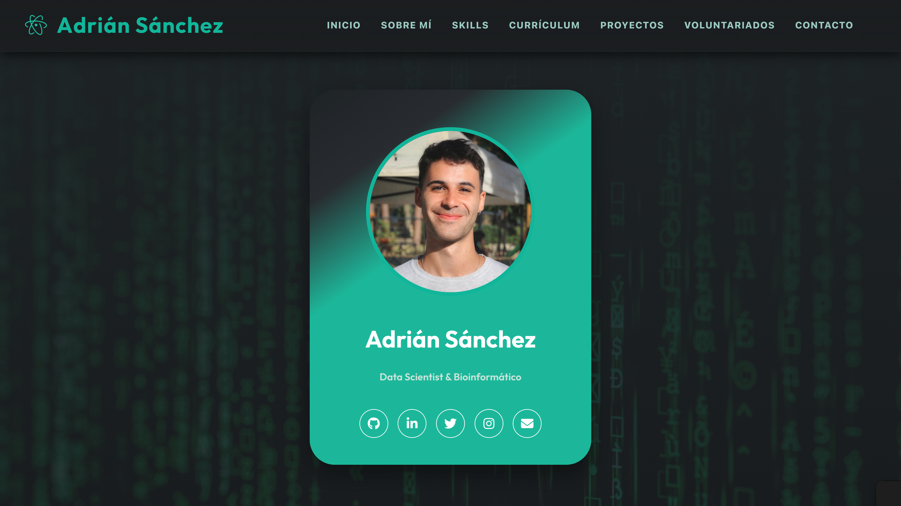

<p align="center">
  
</p>

<div align="center">
  <h1><span style="color: #46b698;">Personal website to showcase my experience, projects, and skills</span></h1>

  <hr style="border:none; height:0.3px; background-color:#777; width:65%; margin:30px auto 35px auto;">

  <p>
    <a href="https://developer.mozilla.org/en-US/docs/Web/HTML"></a>
    <a href="https://developer.mozilla.org/en-US/docs/Web/CSS"></a>
    <a href="https://developer.mozilla.org/en-US/docs/Web/JavaScript"></a>
    <a href="https://www.markdownguide.org/"></a>
    <a href="https://git-scm.com/"></a>
    <a href="https://github.com/"></a>
  </p>

  <p>
    <a href="## 📄 Description">Description</a> •
    <a href="## 📂 Structure">Structure</a> • 
    <a href="## 🌐 Exploration">Exploration</a> • 
    <a href="## 🚀 Technologies">Technologies</a> • 
    <a href="## 📬 Contact">Contact</a>
  </p>
</div>


<br>

---

## 📄 Description

<p align="center">
  
</p>

Welcome to my **personal portfolio**! 👋  

This repository contains my personal website, where I showcase my **professional experience**, **academic background**, **projects**, **skills**, and **volunteering activities** in an interactive and visual way. It is designed to show who I am, what I do, and how I work, combining a clean, modern style with animations and visual resources for easy navigation.  


<br>

---

## 💻 About this repository

Here you will find all the files needed for my portfolio to work properly. The repository is organized as follows: 

```plaintext
spanish-portfolio
├── index.html
├── README.md
└── resources
    ├── 1-scripts  # Folder with website scripts
    ├── 2-images  # Folder with images and visual resources
    ├── 3-documents  # Folder with PDF documents
    ├── 4-projects  # Folder with GIFs and screenshots of projects
    └── 5-volunteerings  # Folder with GIFs and screenshots of volunteer work
```

Where:

- `index.html`: main portfolio page.  
- `resources/`: folder containing all visual resources, documents, projects, images, and scripts used on the site.  
- `script.js` and `styles.css`: files controlling interactivity and styling.  
- PDF documents of my **curriculum vitae**.  
- GIFs and images of my **projects** and **volunteering experiences**.  

This repository is designed so that anyone can explore the portfolio live, download it, or even use it as inspiration for their own personal website.


<br>

---

## 🌐 Explore my portfolio

I invite you to visit my portfolio live and discover all my work:  

👉 [**View my portfolio**](https://adrichez.github.io/english-portfolio/)  

You will find sections like:  

- **About Me**: a summary of my professional profile and interests.  
- **Skills**: technical and professional skills with visual progress bars.  
- **Curriculum Vitae**: work experience and academic education, including international studies and exchange programs.  
- **Projects**: featured works with animations and detailed descriptions.  
- **Volunteering**: experiences in social and cultural projects in Spain and Italy.  
- **Contact**: direct contact form and my information to connect with me.  


<br>

---

## 🚀 Technologies and tools

My portfolio is built with modern, easy-to-maintain web technologies:  

- **HTML5, CSS3, and JavaScript**.
- Animations and interactivity to enhance user experience.
- Modular structure for easy updates of projects, documents, and sections.


<br>

---

## 🤝 Let's connect!

If you want to get in touch with me:  

- 📧 Email: [asanca33@gmail.com](mailto:asanca33@gmail.com)  
- 📞 Phone: [+34 673 49 99 51](tel:+34673499951)  
- 📍 Location: Granada, Spain.

You can also use the **contact form** on the website to message me directly.  


<br>

---

> This portfolio reflects my work, education, and projects.  
> Thank you for visiting! 💜  
