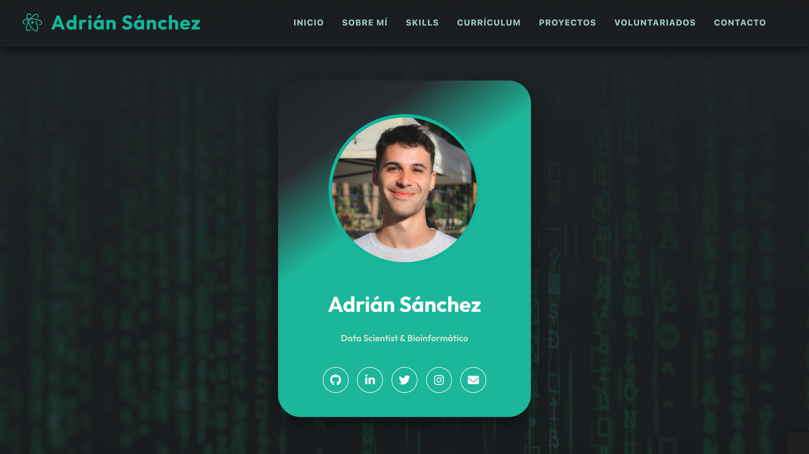

# 🌟 Adrian Sanchez Carrion's Portfolio

  

 

Welcome to my **personal portfolio**! 👋  

This repository contains my personal website, where I showcase my **professional experience**, **academic background**, **projects**, **skills**, and **volunteering activities** in an interactive and visual way. It is designed to show who I am, what I do, and how I work, combining a clean, modern style with animations and visual resources for easy navigation.  

 

---

## 💻 About this repository

Here you will find all the files needed for my portfolio to work properly:

- `index.html`: main portfolio page.  
- `resources/`: folder containing all visual resources, documents, projects, images, and scripts used on the site.  
- `script.js` and `styles.css`: files controlling interactivity and styling.  
- PDF documents of my **curriculum vitae**.  
- GIFs and images of my **projects** and **volunteering experiences**.  

This repository is designed so that anyone can explore the portfolio live, download it, or even use it as inspiration for their own personal website.

 

---

## 🌐 Explore my portfolio

I invite you to visit my portfolio live and discover all my work:  

[**View my portfolio**](https://adrichez.github.io/english-portfolio/)  

You will find sections like:  

- **About Me**: a summary of my professional profile and interests.  
- **Skills**: technical and professional skills with visual progress bars.  
- **Curriculum Vitae**: work experience and academic education, including international studies and exchange programs.  
- **Projects**: featured works with animations and detailed descriptions.  
- **Volunteering**: experiences in social and cultural projects in Spain and Italy.  
- **Contact**: direct contact form and my information to connect with me.  

 

---

## 🚀 Technologies and tools

My portfolio is built with modern, easy-to-maintain web technologies:  

- **HTML5, CSS3, and JavaScript**  
- Animations and interactivity to enhance user experience  
- Modular structure for easy updates of projects, documents, and sections  

 

---

## 🤝 Let's connect!

If you want to get in touch with me:  

- 📧 Email: [asanca33@gmail.com](mailto:asanca33@gmail.com)  
- 📞 Phone: [+34 673 49 99 51](tel:+34673499951)  
- 📍 Location: Granada, Spain  

You can also use the **contact form** on the website to message me directly.  

 

---

> This portfolio reflects my work, education, and projects.  
> Thank you for visiting! 💜  
